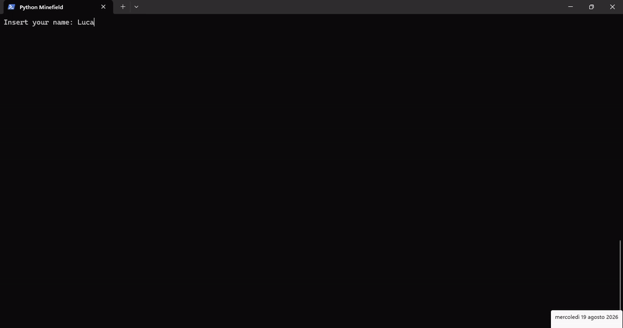

# 💣 Python Minefield

[](https://badge.fury.io/py/python-minefield)
[](https://github.com/defra91/python-minefield/actions/workflows/ci.yml)
[](https://pypi.org/project/python-minefield/)
[](https://opensource.org/licenses/MIT)

A lightweight and fun **Minesweeper clone** written in Python.

[](./images/demo.gif)

## About The Project

This project helped me to face the boring summer days when the temperature outside was too hot to do anything else.

I wanted to learn Python from scratch, so I decided to build a simple clone of the classic **Minesweeper** game. It is intentionally lightweight and simple — the main goal is to learn Python, follow modern project setups, and have fun along the way.

Please feel free to contribute or fork this project, and if you have any suggestions or improvements, I would be happy to hear them.

One last thing: forgive me for the lack of documentation or best practices. I am doing my best, but remember that I am on holidays and I am looking for fun and enjoyment. We will reach for perfection the next time, I promise.

## Quick Start (via `pip`)

The fastest way to play the game is directly via PyPI!

```bash
pip install python-minefield
python-minefield
```

## Development and Contribution

### Why `uv`?

This project is built using `uv`, a modern tool that allows to run Python code in a fast and efficient way. This tools is used as our primary Python package and project manager. I have decided to use uv because:

- It's written in Rust, therefore guarantees high performances.
- It simplifies dependency management for Python projects.
- It collects multiple tools in a single one, which makes it easier to use and learn.
- Ensures reproducible installations across different environments
- Downloads and manages different Python versions, which is useful for testing and compatibility.


```bash
curl -LsSf https://astral.sh/uv/install.sh | sh
```

## Get Started

### Clone the repository

```bash
git clone https://github.com/defra91/python-minefield.git
cd python-minefield
```

### Install dependencies

```bash
uv sync --all-extras --dev
```

### Run Locally

```bash
uv run python-minefield
```

### Run Tests & Linter

```bash
uv run ruff check .
uv run pytest
```